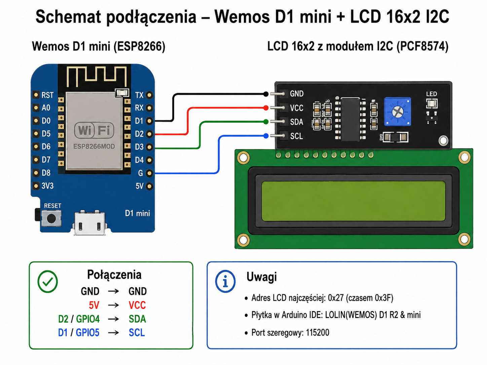

# ADSB-LCD-ESP8266

**Wemos D1 mini (ESP8266) + LCD 16×2 I²C** wyświetlający na żywo dane najbliższego samolotu z lokalnego **Virtual Radar Server (VRS)**.

Urządzenie pobiera `AircraftList.json` przez Wi‑Fi, wybiera najbliższy samolot w konfigurowanym promieniu i cyklicznie prezentuje jego dane na LCD. Konfiguracja, podgląd LCD, OTA i funkcje serwisowe są dostępne z wbudowanego panelu WWW.



## Aktualna wersja

**v16.0** — aktualna wersja rozwojowa firmware.

Starsza, stabilna wersja **v14.1** pozostaje dostępna:

- w katalogu [`firmware/releases/v14.1/`](firmware/releases/v14.1/)
- na gałęzi [`v14.1-stable`](../../tree/v14.1-stable)

Pełna historia zmian: [CHANGELOG.md](CHANGELOG.md).

## Najważniejsze funkcje

- pobieranie danych z lokalnego VRS (`AircraftList.json`)
- wybór najbliższego samolotu według `Dst`
- **9 ekranów LCD**
- pełna nazwa modelu i operator
- callsign i rejestracja
- species i engines
- odległość + `INCOMING / OUTCOMING`
- prędkość w km/h i węzłach
- Flight Level
- heading/track i bearing z kierunkami świata
- ICAO i squawk
- ekran **TRASA** z pól VRS `From`, `Stops`, `To`
- liczba wszystkich samolotów VRS (`totalAc`)
- animacja **NOWY NAJBLIZSZY**
- alert LPR z konfigurowanym miganiem podświetlenia
- nocne wygaszanie LCD
- czas polski CET/CEST wyliczany na podstawie `stm` z VRS
- konfiguracja zapisywana w LittleFS
- mDNS: `http://adsb-display.local/`

### Nowości v16

- **podgląd fizycznego LCD 16×2 w panelu WWW**
- przyciski WWW: następny ekran, LCD AUTO/ON/OFF, test LPR, restart
- **OTA przez WWW** pod `/update`
- **MQTT + Home Assistant MQTT Discovery**
- profile wyświetlania: `CUSTOM`, `NORMAL`, `MINIMAL`, `SPOTTER`, `FULL`

## Hardware

- Wemos D1 mini / ESP8266
- LCD 16×2 HD44780
- konwerter I²C PCF8574, zwykle `0x27`
- przewody połączeniowe
- lokalny odbiornik ADS‑B + Virtual Radar Server

## Podłączenie

| LCD 16×2 I²C | Wemos D1 mini | ESP8266 GPIO |
|---|---|---|
| GND | G | GND |
| VCC | 5V | 5 V |
| SDA | D2 | GPIO4 |
| SCL | D1 | GPIO5 |

Jeżeli LCD nie odpowiada pod `0x27`, sprawdź również `0x3F`.

## Arduino IDE

Płytka:

```text
LOLIN(WEMOS) D1 R2 & mini
```

Zalecany układ flash:

```text
4MB (FS:2MB OTA:~1019KB)
```

Serial Monitor:

```text
115200 baud
```

### Biblioteki

Zainstaluj:

- **ArduinoJson 7.x**
- **LiquidCrystal_I2C** kompatybilną z ESP8266
- **PubSubClient by Nick O'Leary** — wymagane w v16 dla MQTT

Pozostałe biblioteki (`ESP8266WiFi`, `ESP8266HTTPClient`, `ESP8266WebServer`, `ESP8266HTTPUpdateServer`, `ESP8266mDNS`, `LittleFS`) są częścią pakietu ESP8266 dla Arduino IDE.

> Niektóre wersje `LiquidCrystal_I2C` wyświetlają ostrzeżenie dotyczące architektury AVR. Jeżeli projekt się kompiluje i LCD działa, samo ostrzeżenie nie jest błędem wykonania.

## Instalacja

1. Pobierz lub sklonuj repozytorium.
2. Otwórz aktualny firmware z katalogu `firmware/ADSB_LCD_Display/`.
3. Ustaw dane Wi‑Fi:

```cpp
const char* WIFI_SSID = "YOUR_WIFI_SSID";
const char* WIFI_PASSWORD = "YOUR_WIFI_PASSWORD";
```

4. Zmień domyślne hasło OTA:

```cpp
const char* OTA_PASSWORD = "CHANGE_ME_NOW";
```

5. Skompiluj i wgraj firmware do D1 mini.
6. Otwórz Serial Monitor na `115200`.
7. Wejdź na:

```text
http://adsb-display.local/
```

Jeżeli mDNS nie działa w Twojej sieci, użyj adresu IP pokazanego w Serial Monitorze.

## Panel WWW

W panelu można ustawić m.in.:

- URL `AircraftList.json`
- pozycję odbiornika (`lat`, `lon`)
- promień wyboru najbliższego samolotu
- częstotliwość pobierania danych VRS
- czas wyświetlania ekranów
- nocne wygaszanie LCD
- alert LPR
- próg `INCOMING / OUTCOMING`
- włączanie/wyłączanie ekranów
- profil wyświetlania
- ustawienia MQTT

Ustawienia są zapisywane w LittleFS do `/config.json`.

## Podgląd LCD i sterowanie WWW

v16 pokazuje w przeglądarce aktualną zawartość fizycznego LCD 16×2. Dostępne są także:

- następny ekran
- LCD `AUTO`
- LCD `ON`
- LCD `OFF`
- test alarmu LPR
- restart ESP8266

## OTA przez WWW

Strona aktualizacji firmware:

```text
http://adsb-display.local/update
```

Domyślny użytkownik:

```text
admin
```

Przed normalnym użyciem zmień `OTA_PASSWORD` w kodzie.

## Home Assistant / MQTT

v16 obsługuje MQTT oraz **Home Assistant MQTT Discovery**. Po włączeniu MQTT w panelu WWW i podaniu danych brokera Home Assistant może automatycznie utworzyć encje.

Publikowane są m.in.: callsign, rejestracja, model, operator, odległość, trend, prędkość, Flight Level, heading, bearing, ICAO, squawk, trasa, liczba samolotów VRS, status VRS oraz aktualne linie LCD.

Home Assistant otrzymuje również sterowanie:

- **Display Profile**
- **LCD Mode**

## Profile wyświetlania

| Profil | Zastosowanie |
|---|---|
| `CUSTOM` | używa indywidualnych checkboxów ekranów z WWW |
| `NORMAL` | zbalansowany zestaw informacji do codziennego użycia |
| `MINIMAL` | model, odległość i prędkość |
| `SPOTTER` | call/reg, położenie, ICAO/squawk i trasa |
| `FULL` | wszystkie dostępne ekrany |

## Ekrany LCD

Po animacji **NOWY NAJBLIZSZY** v16 może wyświetlać 9 ekranów:

1. model / operator
2. callsign / registration
3. species / engines
4. distance / incoming-outgoing
5. speed / Flight Level
6. heading / bearing
7. ICAO / squawk
8. trasa
9. liczba samolotów VRS

Długie nazwy modelu i trasy są przewijane.

## Dane VRS

Firmware wykorzystuje m.in. pola `Dst`, `Brng`, `Spd`, `SpdTyp`, `Alt`, `Trak`, `TrkH`, `Call`, `Reg`, `Icao`, `Type`, `Mdl`, `Op`, `OpCode`, `Species`, `Engines`, `EngType`, `Sqk`, `From`, `Stops`, `To`, `totalAc` i `stm`.

## Bezpieczeństwo

Nie publikuj prawdziwego SSID, hasła Wi‑Fi, hasła OTA ani danych MQTT w repozytorium. Publiczna wersja firmware powinna używać wartości przykładowych/placeholderów.

## Struktura repozytorium

```text
ADSB-LCD-ESP8266/
├── README.md
├── CHANGELOG.md
├── .gitignore
├── docs/
│   └── wiring.png
└── firmware/
    ├── ADSB_LCD_Display/
    │   └── ADSB_LCD_Display.ino
    └── releases/
        └── v14.1/
            └── ADSB_LCD_Display_v14.1.ino
```

## Status

Projekt został przetestowany na Wemos D1 mini / ESP8266 oraz LCD 16×2 z konwerterem PCF8574.