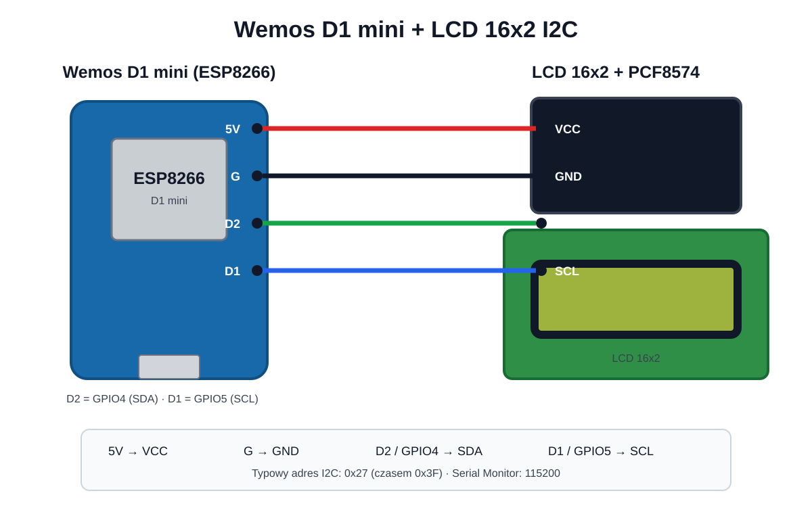

# ADSB-LCD-ESP8266

**Wemos D1 mini (ESP8266) + LCD 16×2 I²C** pokazujący dane najbliższego samolotu z lokalnego **Virtual Radar Server (VRS)**.

Urządzenie pobiera `AircraftList.json` po Wi‑Fi, wybiera najbliższy samolot w zadanym promieniu i cyklicznie prezentuje dane na LCD. Ma też prosty panel WWW do konfiguracji bez ponownego wgrywania firmware.



## Funkcje

- pobieranie danych z lokalnego Virtual Radar Server (`AircraftList.json`)
- wybór najbliższego samolotu według pola `Dst`
- 8 ekranów LCD, każdy może być osobno włączony/wyłączony
- czas wyświetlania ekranów konfigurowany z WWW
- pełny model samolotu i operator
- callsign i rejestracja
- species i engines
- odległość oraz `INCOMING` / `OUTCOMING`
- prędkość w km/h oraz węzłach
- Flight Level
- heading/track i bearing wraz z kierunkami N/NE/E/SE/S/SW/W/NW
- ICAO i squawk
- liczba wszystkich samolotów śledzonych przez VRS (`totalAc`)
- animacja **NOWY NAJBLIŻSZY**
- alarm LPR: 3× miganie LCD, gdy LPR zostanie nowym najbliższym samolotem
- automatyczne wygaszanie podświetlenia, domyślnie 21:00–06:00
- czas lokalny wyliczany z pola `stm` VRS z obsługą CET/CEST
- prosty panel WWW z zapisem ustawień do LittleFS
- mDNS: `http://adsb-display.local/`

## Wymagania

### Hardware

- Wemos D1 mini / ESP8266
- LCD 16×2 HD44780
- konwerter I²C PCF8574, najczęściej adres `0x27`
- przewody połączeniowe
- lokalny odbiornik ADS-B + Virtual Radar Server

### Arduino IDE

Wybierz płytkę:

```text
LOLIN(WEMOS) D1 R2 & mini
```

Zalecane ustawienie pamięci flash:

```text
4MB (FS:2MB OTA:~1019KB)
```

Port szeregowy:

```text
115200 baud
```

### Biblioteki

Zainstaluj:

- **ArduinoJson 7.x**
- **LiquidCrystal_I2C** kompatybilną z ESP8266

Pozostałe biblioteki (`ESP8266WiFi`, `ESP8266HTTPClient`, `ESP8266WebServer`, `ESP8266mDNS`, `LittleFS`) są częścią pakietu ESP8266 dla Arduino IDE.

> Niektóre wydania `LiquidCrystal_I2C` mogą wyświetlać ostrzeżenie o architekturze AVR. Jeżeli szkic się kompiluje i LCD działa, samo ostrzeżenie nie jest błędem wykonania.

## Podłączenie

| LCD 16×2 I²C | Wemos D1 mini | ESP8266 GPIO |
|---|---|---|
| GND | G | GND |
| VCC | 5V | 5 V |
| SDA | D2 | GPIO4 |
| SCL | D1 | GPIO5 |

Jeżeli LCD nie odpowiada pod `0x27`, sprawdź również `0x3F`.

## Instalacja

1. Pobierz repozytorium.
2. Otwórz:

```text
firmware/ADSB_LCD_Display/ADSB_LCD_Display.ino
```

3. Wpisz dane Wi‑Fi:

```cpp
const char* WIFI_SSID = "YOUR_WIFI_SSID";
const char* WIFI_PASSWORD = "YOUR_WIFI_PASSWORD";
```

4. Wgraj firmware do D1 mini.
5. Otwórz Serial Monitor na `115200`.
6. Po połączeniu z Wi‑Fi otwórz:

```text
http://adsb-display.local/
```

Jeżeli mDNS nie działa w Twojej sieci, użyj adresu IP pokazanego w Serial Monitorze.

## Konfiguracja WWW

W panelu można ustawić m.in.:

- URL `AircraftList.json`
- pozycję odbiornika (`lat`, `lon`)
- maksymalny promień wyboru najbliższego samolotu
- częstotliwość pobierania danych VRS
- czas wyświetlania pojedynczego ekranu
- nocne wygaszanie LCD i godziny ON/OFF
- alarm LPR i liczbę mignięć
- próg `INCOMING / OUTCOMING`
- włączanie/wyłączanie każdego z 8 ekranów

Ustawienia są zapisywane w LittleFS do `/config.json` i pozostają po restarcie.

## Konfiguracja Virtual Radar Server

Firmware korzysta z endpointu:

```text
http://ADRES_VRS:8090/VirtualRadar/AircraftList.json
```

Do zapytania dodawane są współrzędne odbiornika oraz maksymalny dystans. VRS zwraca wtedy m.in.:

- `Dst` — odległość w km
- `Brng` — bearing od pozycji odbiornika
- `Spd` — ground speed w kt
- `Alt` — wysokość w ft
- `Trak` — track/heading zależnie od `TrkH`
- `Call`, `Reg`, `Icao`
- `Type`, `Mdl`, `Op`, `OpCode`
- `Species`, `Engines`, `EngType`
- `Sqk`
- `totalAc`
- `stm` — czas serwera UTC w ms

## Ekrany LCD

Po animacji **NOWY NAJBLIŻSZY** ekrany mogą wyglądać tak:

```text
Airbus A321-251N
   Wizz Air
```

```text
 CALL: WZZ123
 REG: HA-LXY
```

```text
   LANDPLANE
      2 JET
```

```text
 DIST: 12.4 km
    INCOMING
```

```text
907km/h (490kt)
     FL370
```

```text
   HDG 305 NW
    BRG 267 W
```

```text
 ICAO: 471F9A
 SQUAWK: 4721
```

```text
  SAMOLOTY VRS
       146
```

Długie nazwy modelu są przewijane na LCD 16×2.

## LPR

Alarm LPR jest uruchamiany, gdy nowy najbliższy statek powietrzny zostanie rozpoznany na podstawie m.in.:

- `OpCode == "LPR"`
- callsign rozpoczynającego się od `LPR`
- nazwy operatora zawierającej `LOTNICZE POGOTOWIE RATUNKOWE`
- nazwy operatora zawierającej `POLISH MEDICAL AIR RESCUE`

LCD wyświetla pierwszy ekran i miga podświetleniem określoną liczbę razy.

## Wygaszanie nocne

Domyślnie:

```text
OFF: 21:00
ON : 06:00
```

ESP8266 nadal pobiera dane i śledzi samoloty — wyłączane jest tylko podświetlenie LCD. Czas jest synchronizowany z polem `stm` zwracanym przez VRS, a czas polski jest wyliczany z obsługą CET/CEST.

## Bezpieczeństwo

Nie publikuj prawdziwego SSID ani hasła Wi‑Fi w repozytorium. Przed commitem zawsze sprawdź:

```cpp
const char* WIFI_SSID = "YOUR_WIFI_SSID";
const char* WIFI_PASSWORD = "YOUR_WIFI_PASSWORD";
```

## Struktura repozytorium

```text
ADSB-LCD-ESP8266/
├── README.md
├── .gitignore
├── docs/
│   └── wiring.svg
└── firmware/
    └── ADSB_LCD_Display/
        └── ADSB_LCD_Display.ino
```

## Status

Projekt został przetestowany na Wemos D1 mini / ESP8266 oraz LCD 16×2 z konwerterem PCF8574.
